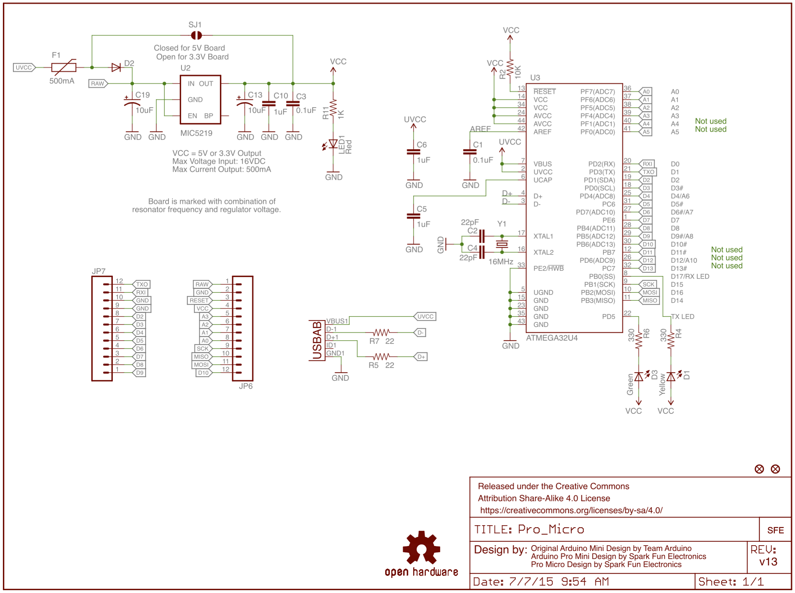
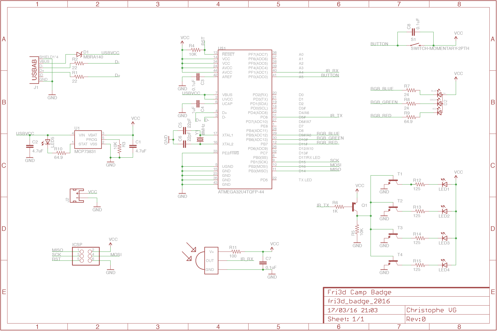
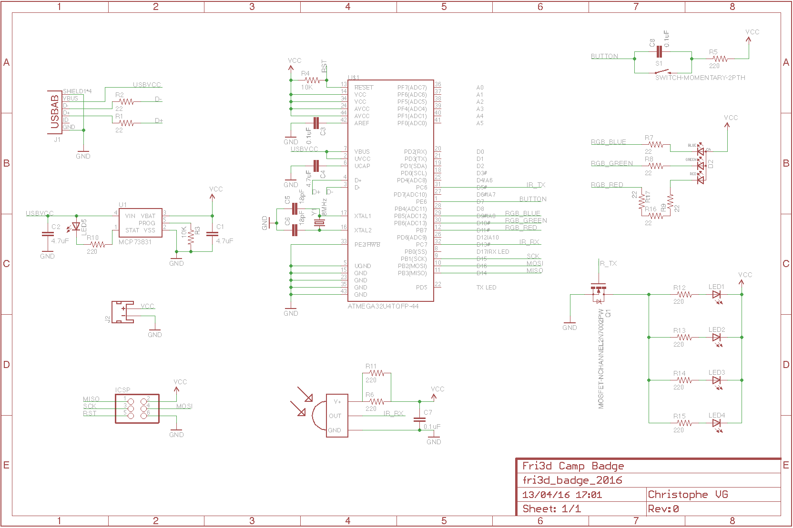
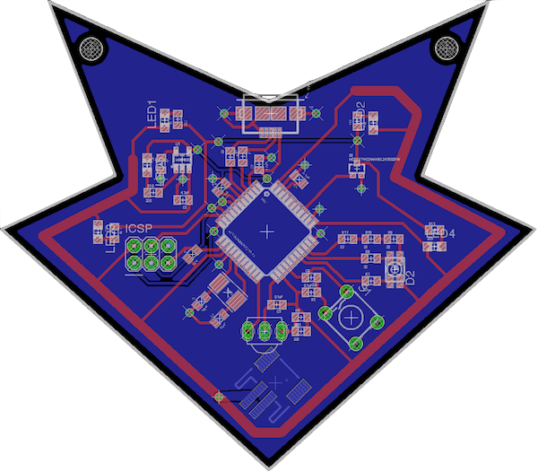

# Design Dagboek

Aangezien dit [mijn](http://christophe.vg) eerste SMD-gebaseerde ontwerp is, zal het een fijne leerschool worden. Daarom wil ik deze hier documenteren, voor mezelf, maar ook voor iemand anders die het ook wel eens van naderbij wil bekijken.

## Klaar? ... Start ... Leer!

Ik heb gekozen voor
[Eagle](http://www.cadsoftusa.com/eagle-pcb-design-software/about-eagle/), de de facto standaard editor voor PCB ontwerp. De [gratis versie](http://www.cadsoftusa.com/download-eagle/freeware/) biedt alle mogelijkheden, met beperkingen waar je niet snel tegen loopt als beginner. De software is tevens beschikbaar voor alle courante platformen (Windows, Linux, Max OS X), wat niet het geval is met de meeste concurrenten.

Software kiezen is één, er mee werken... Gelukkig zijn er zeer goeie tutorials online te vinden:

* [https://learn.sparkfun.com/tutorials/how-to-install-and-setup-eagle](https://learn.sparkfun.com/tutorials/how-to-install-and-setup-eagle)
* [https://learn.sparkfun.com/tutorials/using-eagle-schematic](https://learn.sparkfun.com/tutorials/using-eagle-schematic)
* [https://learn.sparkfun.com/tutorials/using-eagle-board-layout](https://learn.sparkfun.com/tutorials/using-eagle-board-layout)
* [https://learn.sparkfun.com/tutorials/designing-pcbs-advanced-smd](https://learn.sparkfun.com/tutorials/designing-pcbs-advanced-smd)

## De schouders van reuzen

Het wiel uitvinden is al lang niet meer nodig in het koninkrijk van electronica. Er zijn heel veel designs te vinden die allemaal een deel van de puzzel kunnen zijn. Zo ben ik ook vertrokken van enkele grote puzzelstukken en heb die bij elkaar gebracht.

### Arduino Micro Pro 3.3V

De basis van het ontwerp is de Arduino Micro Pro in de versie die op 3.3V werkt. Deze bevat alle minimale eisen die we stelden aan het ontwerp, in een redelijk eenvoudig samen te stellen geheel. De microcontroller, de ATMEGA32u4, bevat USB connectiviteit, waardoor eenvoudige ondersteuning voor de Arduino IDE en programmaring mogelijk wordt.

[https://www.sparkfun.com/products/12587](https://www.sparkfun.com/products/12587)

### TV B Gone

De initiële plannen om een draadloze netwerk-verbinding te incorporeren, strandden toen we de prijzen zagen voor de RF modules. Gelukkig bestaat er een "goedkoop" alternatief, die relatief dezelfde technologie introduceert, op een veel eenvoudigere en betaalbare manier: infra-rode (IR) stralen.

En als we aan IR denken, komen we al snel uit bij Mitch Altmans TV B Gone. Deze IR zendende oplossing kan prima dienen als referentie design voor deze functionaliteit.

[https://learn.adafruit.com/tv-b-gone-kit/download](https://learn.adafruit.com/tv-b-gone-kit/download) 

### LiPo oplaad circuit

De IR LEDs trekken al snel een stroom die boven de mogelijkheden liggen van een coin cell batterij. We konden gaan voor 2 AAA batterijen, maar dan wordt de badge al snel log en zwaar. Daarom proberen we bij het initiële design te vertrekken van een herlaadbare LiPo batterij.

Om deze te kunnen opladen, hebben we een integratie nodig met de inkomende USB voeding. Gelukkig bestaat ook daarvoor een bijna de facto oplossing en is ook het omringende oplaad-circuit mooi gedocumenteerd.

[https://learn.sparkfun.com/tutorials/lipo-usb-charger-hookup-guide](https://learn.sparkfun.com/tutorials/lipo-usb-charger-hookup-guide)

### Fri3d Badge Schema versie 1

De combinatie van de drie voorgaand vermelde referentie designs, gecombineerd met nog een knopje, RGB LED en IR ontvanger, levert ons ...

## Eerste optimalisaties

Met versie 1 onder de arm op naar enkele hulplijnen. Met het oog op zo veel mogelijk automatisering van de productie, zijn enkele aspecten zeer belangrijk:

1. Hoe minder componenten, hoe minder er kan fout gaan.
2. Hoe minder verschillende componenten, hoe meer dat er geautomatiseerd kan verlopen.

Met dat motto in gedachte werden volgende aanpassingen aan versie 1 doorgevoerd:

1. Vervanging van de PNP + NPN constructie voor de IR LEDs door een enkele N-channel MOSFET.
2. Vervanging van weerstanden door combinaties van dezelfde weerstanden (e.g. 2 weerstanden van 220&ohm; in parallel is ongeveer gelijk aan één van 100&ohm; enz)
3. Enkele fouten en redundante componenten werden bijgewerkt/verwijderd.

### Fri3d Badge Schema versie 2

En dat levert ons een versie op waarmee ik aan de slag kan om de layout van de PCB te maken...

## PCB Layout

De Fri3d Badge heeft op het eerste zicht al één belangrijke eigenschap: zijn vorm is geen klassieke PCB-vorm, want we willen ze de vorm geven van het logo.

Na het tekenen van de omtrek ga je aan de slag om de componenten een plek te geven. Hierbij probeer je zo veel mogelijk logische blokken te maken en het aantal kruisende lijnen (air wires) te minimaliseren.

De PCB zal opgebouwd worden uit twee lagen, de voor- en achterkant van de badge. Op de achterkant komt hoofdzakelijk de oplaadbare batterij en de bijhorende connector. Centraal op de voorkant komt de microcontroller en daarrond de verschillende functionele componenten: IR LEDs, IR receiver, RGB LED, knop, laadcircuit, USB connector, ICSP connector.

Na een avondje zwoegen kom je dan, met wat hulp, tot een eerste PCB layout:

Enkele tips:

* Creëer op de onderkant een groot vlak en verbindt dit met GND. Nu hoef je van de bovenkant slechts een via te maken en je hebt directe toegang tot de GND. Zie het grote blauwe vlak op de layout hierboven.
* De zelfde truc kan je bij een meer-dan-twee lagen PCB ook doen voor VCC, maar die luxe hebben we hier niet. Daarom truc nr. 2: maak een dikke VCC-omranding! Niet meer gewoon te bereiken met een via, maar wel langs een kort baantje naar de buitenzijde van de PCB.

### Eerste Prototype(s)

En dan is het tijd om de virtuele wereld van Eagle te verlaten en echte prototypes te maken. Met een koffer vol componenten trokken we naar het electronica-lab van de Erasmus Hoge School om zelf PCBs te etsen en te voorzien van componenten - een hele onderneming.

**Wordt vervolgd...**
